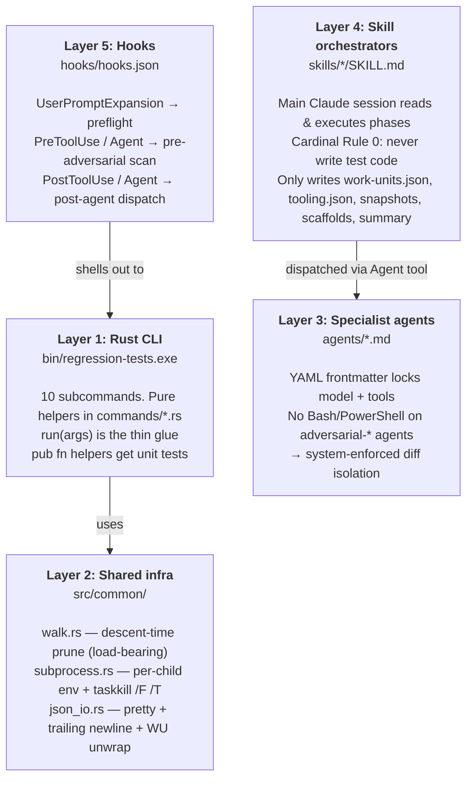
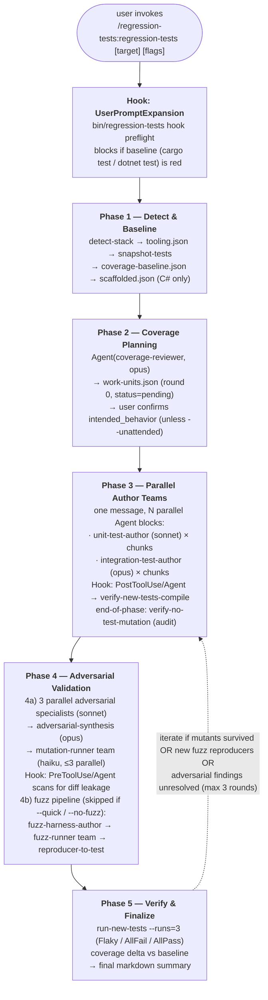
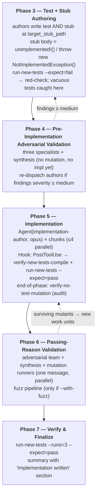
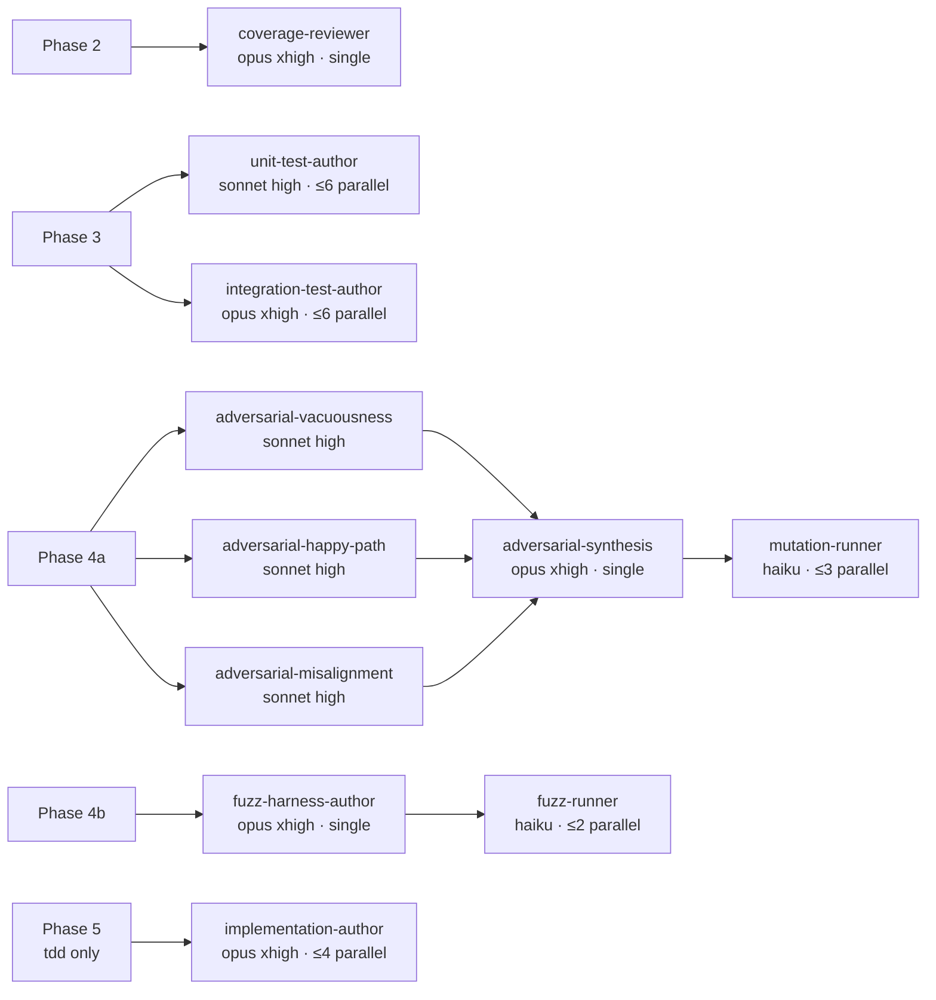

# Technical guide - `regression-tests-plugin`

A contributor-oriented walkthrough of the plugin's architecture, dispatch graphs, file lifecycle, and extension points. Pairs with [`CLAUDE.md`](../CLAUDE.md) (cardinal rules and gotchas) and [`README.md`](../README.md) (end-user install + usage).

Read CLAUDE.md first if you intend to *modify* the plugin - it contains the load-bearing invariants. This document explains the *shape*; CLAUDE.md explains the *rules*.

## Table of contents

- [What ships in this repo](#what-ships-in-this-repo)
- [The five-layer architecture](#the-five-layer-architecture)
- [Skill phase flow](#skill-phase-flow)
- [Agent dispatch graph](#agent-dispatch-graph)
- [Hook lifecycle](#hook-lifecycle)
- [The Rust CLI surface](#the-rust-cli-surface)
- [Run-state file lifecycle](#run-state-file-lifecycle)
- [The WorkUnit contract](#the-workunit-contract)
- [Test isolation invariants](#test-isolation-invariants)
- [Extension recipes](#extension-recipes)
- [Cross-platform status](#cross-platform-status)

## What ships in this repo

Five artifact classes - only one of them is "the Rust crate":

```
regression-tests-plugin/
├── .claude-plugin/         (1) Marketplace + plugin metadata
│   ├── marketplace.json
│   └── plugin.json
├── skills/                 (2) Two skill orchestrator playbooks
│   ├── regression-tests/SKILL.md
│   └── tdd/SKILL.md
├── agents/                 (3) Eleven specialist agent definitions
│   ├── coverage-reviewer.md
│   ├── unit-test-author.md
│   ├── integration-test-author.md
│   ├── adversarial-vacuousness.md
│   ├── adversarial-happy-path.md
│   ├── adversarial-misalignment.md
│   ├── adversarial-synthesis.md
│   ├── mutation-runner.md
│   ├── fuzz-harness-author.md
│   ├── fuzz-runner.md
│   └── implementation-author.md
├── hooks/                  (4) Three Claude Code hook bindings
│   └── hooks.json
├── bin/regression-tests.exe (5a) Pre-built helper binary (committed, ~3MB)
├── src/                    (5b) Helper-binary source (10 subcommands)
│   ├── main.rs
│   ├── lib.rs
│   ├── commands/*.rs       (10 files - one per subcommand)
│   └── common/*.rs         (walk, subprocess, json_io)
└── schemas/work-unit.schema.json   The orchestrator ↔ author contract
```

The **primary output** is (1) + (2) + (3) + (4) - the skill + agents + hooks that orchestrate Claude Code subagents. The Rust crate (5a/5b) is the *deterministic helper* that the skills shell out to for everything an LLM should not be doing (parsing test output, walking directories, hashing files, killing process trees, etc.).

## The five-layer architecture



**Cardinal rule per layer** (each layer has exactly one):

* Layer 1 → pure helpers and `run()` glue are separate; tests target the helpers.
* Layer 2 → use descent-time prune in walks; per-child env in subprocess; never `std::env::set_var`.
* Layer 3 → tool restrictions are *contracts*, not advisories. Don't relax them.
* Layer 4 → the orchestrator never writes test code. Specialists do.
* Layer 5 → decision logic in `hook.rs` is pure and unit-tested; the shell is thin.

## Skill phase flow

Both skills share a coverage-planning → authoring → adversarial-review → mutation cadence. The `tdd` skill adds an implementation phase and a second adversarial pass.

### `regression-tests` skill (5 phases)



### `tdd` skill (7 phases)

Same Phase 1-2, but the `coverage-reviewer` runs in `spec` mode and populates `target_stub_path`. Phase 3 authors write tests *and* compile-fail stubs. New phases:



## Agent dispatch graph

Eleven specialist agents, four model tiers, three concurrency patterns. Fan-out by phase:



Tool inventory:

| Agent | Model | Effort | Tools | Dispatch |
|---|---|---|---|---|
| `coverage-reviewer` | opus | xhigh | Read, Grep, Glob | single, Phase 2 |
| `unit-test-author` | sonnet | high | Read, Grep, Glob, Write, Edit | ≤6 parallel |
| `integration-test-author` | opus | xhigh | Read, Grep, Glob, Write, Edit | ≤6 parallel |
| `adversarial-vacuousness` | sonnet | high | Read, Grep, Glob | 3 in parallel, one message |
| `adversarial-happy-path` | sonnet | high | Read, Grep, Glob | 3 in parallel, one message |
| `adversarial-misalignment` | sonnet | high | Read, Grep, Glob | 3 in parallel, one message |
| `adversarial-synthesis` | opus | xhigh | Read, Grep, Glob | single, after specialists |
| `mutation-runner` | haiku | — | Read, Bash, PowerShell | ≤3 parallel |
| `fuzz-harness-author` | opus | xhigh | Read, Grep, Glob, Write, Edit, Bash, PowerShell | single |
| `fuzz-runner` | haiku | — | Read, Glob, Bash, PowerShell | ≤2 parallel |
| `implementation-author` | opus | xhigh | Read, Grep, Glob, Write, Edit | ≤4 parallel (tdd Phase 5) |

**Tool restrictions are load-bearing.** The three `adversarial-*` specialists do *not* have `Bash` or `PowerShell`. They cannot `git diff`, cannot read git history, cannot shell out. That isolation from "what changed" is the structural guarantee that adversarial review is not anchored to author rationalizations. The plugin's `PreToolUse` hook adds defense-in-depth by scanning prompts for forbidden strings (`--- a/`, `+++ b/`, `git diff`) before the spawn.

**Why three adversarial specialists instead of one super-reviewer.** Each has a single dimension (vacuousness / happy-path / misalignment) and is told explicitly *not* to drift into the others' lanes. Sonnet 4.6 outperforms a multi-dimensional brief; a downstream Opus `adversarial-synthesis` dedupes and ranks the three reports. This is the "panel of specialists + synthesizer" pattern the plugin is built around.

**Why parallel-in-one-message.** Spawning the three adversarial specialists in *separate* messages serializes them - Claude Code only fans out `Agent` tool calls within a single response. Same applies to author chunks in Phase 3 and the synthesis/fuzz parallel pair in Phase 4.

## Hook lifecycle

Three Claude Code hook events, each backed by a pure function in `src/commands/hook.rs`:

| Hook event | Subcommand | Decision logic |
|---|---|---|
| `UserPromptExpansion`<br/>matcher: skill names | `hook preflight` | `is_plugin_skill_invocation()` → Allow (orchestrator runs detect-stack / baseline / lint in Phase 1) |
| `PreToolUse / Agent`<br/>timeout: 5s | `hook pre-adversarial` | `decide_pre_adversarial()` → scans for forbidden strings in prompts for `adversarial-*` subagents → Deny w/ `permissionDecision` |
| `PostToolUse / Agent` | `hook post-agent` | `decide_post_agent()` → unit / integration-test-author → `VerifyNewTestsCompile`; implementation-author → `VerifyNewTestsCompile` + `RunNewTests` |

**Hook response shape.** Renders depend on the event:

* `PreToolUse/Deny` → `{hookSpecificOutput: {permissionDecision: "deny", permissionDecisionReason: "..."}}`.
* `PostToolUse/Preflight Deny` → `{decision: "block", reason: "..."}`.
* `Allow` → empty object (no stdout).
* `RunChecks(...)` → `{checks_to_run: ["verify-new-tests-compile", ...]}` - kebab-case names; orchestrator dispatches.

**Why `verify-no-test-mutation` is not a per-author hook.** An earlier iteration ran SHA-256 checks after every author returned. False positives flooded the test runs because idiomatic Rust source files embed `#[cfg(test)] mod tests`, so a legitimate authoring of an in-source test trips a "test file modified" warning. The current design runs the audit *once* at end-of-phase by the orchestrator (still backed by `bin/regression-tests verify-no-test-mutation`) and relies on the `adversarial-vacuousness` + `adversarial-misalignment` specialists as primary cheat detection.

## The Rust CLI surface

```
regression-tests <subcommand> [options]

  detect-stack              repo→{rust|csharp|both|none} + manifest paths
  preflight                 detect-stack + baseline-check + lint-check
  baseline-check            cargo test --workspace / dotnet test
  lint-check                cargo check + clippy / dotnet build + format
  snapshot-tests            SHA-256 every test file → test-snapshot.json
  verify-no-test-mutation   re-hash against a snapshot, report drift
  verify-new-tests-compile  cargo check / dotnet build for new test files
  fuzz-setup                probe cargo-fuzz / SharpFuzz, list candidates
  reproducer-to-test        crash artifact → deterministic regression test
  run-new-tests             run the new tests N times, classify per-unit
  hook <event>              stdin JSON → hook decision (preflight |
                            pre-adversarial | post-agent)
```

**Architectural pattern across all subcommands** - `commands/<name>.rs` contains:

1. A `#[derive(clap::Args)] pub struct Args` defining the CLI surface.
2. One or more `pub fn` *pure-data helpers* (e.g., `detect_stack(repo_root: &Path)`, `parse_rust_failing_tests(output: &str)`) returning typed results. These get unit tests.
3. A `pub fn run(args: Args) -> anyhow::Result<()>` shell that calls the helpers, serializes the result to pretty JSON, prints to stdout, and sets the exit code.

The split is enforced by testability: a `run(args)` that bakes I/O + parsing + JSON together is untestable. Pulling helpers out means the deterministic logic is covered by 145 unit tests; the `run()` glue is a one-liner.

## Run-state file lifecycle

Every skill invocation gets a `<repo_root>/.claude-regression/<run_id>/` directory (the directory itself is gitignored automatically - the orchestrator appends `.claude-regression/` to `.gitignore` on first run).

```
.claude-regression/<run_id>/                  run_id = YYYYMMDDThhmmss-<4-char hex>
├── work-units.json           Locked WorkUnit list. Single-writer (orchestrator).
├── tooling.json              Per-tool presence map (cargo-mutants, cargo-fuzz, ...).
├── test-snapshot.json        SHA-256 of every pre-existing test file (Phase 1).
├── coverage-baseline.json    cargo-llvm-cov / reportgenerator output (if present).
├── scaffolded.json           Paths to C# *.Tests projects created in Phase 1.
├── state.json                Phase-boundary checkpoint (best-effort resume).
├── baseline.log              cargo test / dotnet test transcript.
├── lint.log                  cargo check + clippy / dotnet build + format transcript.
├── verify-new-tests.log      verify-new-tests-compile transcript.
├── run-new-tests.log         run-new-tests transcript (N runs).
├── diagnostics-*.txt         Per-author or per-implementation retry payloads.
├── quarantine/               Flaky tests moved out of source tree.
└── staged-tests/             --dry-run output (when flag is set).
```

Only the **orchestrator** writes `work-units.json`. Subagents return JSON in their Agent payload; the orchestrator parses and merges. This single-writer invariant is what keeps `intended_behavior` immutable across the run.

## The WorkUnit contract

One file (`schemas/work-unit.schema.json`) governs every cross-agent data exchange in the plugin. The Coverage Reviewer emits these; authors consume them; adversarial specialists are *anchored* to them.

```
WorkUnit
├── id                  UUID v4. Stable across rounds.
├── target_file         Repo-relative path to source under test.
├── target_symbol       Qualified function/method/type name.
├── kind                "unit" | "integration"          → dispatches to author tier
├── intended_behavior   IMMUTABLE after Coverage Reviewer. Min 10 chars.
│                       ↑ Adversarial specialists compare test ↔ this string.
├── preconditions       Setup state (optional).
├── inputs              Input description (optional).
├── expected            Observable outcome (optional).
├── fuzzable            true → Phase 4b fuzz-harness-author considers this target.
├── output_file_path    Pre-assigned to prevent parallel-author collisions.
├── output_test_name    Language-appropriate test name.
├── target_stub_path    TDD-mode only: where the test author writes the stub.
│                       ↑ null in regression-tests mode.
├── status              "pending" | "written" | "implemented" | "rejected_lint" |
│                       "quarantined" | "surfaced_bug"
├── round               -1 (fuzz reproducer) | 0 (initial) | N (adversarial round)
└── source_of_unit      "coverage_reviewer" | "adversarial_reviewer" | "fuzz_runner"
```

**Immutability is the alignment anchor.** Once the Coverage Reviewer commits `intended_behavior`, no downstream agent - author, adversarial reviewer, implementation-author, synthesizer - may rewrite it. Disagreements surface in `notes_to_orchestrator` and route back to the user via the final summary. This is the structural guarantee that the adversarial specialists are reviewing against a fixed contract, not against the test author's evolving interpretation.

## Test isolation invariants

`cargo test --lib` runs 145 tests in ~3 seconds. Three test-isolation invariants must be preserved when adding tests:

**1. No shared mutable env vars across tests.** `cargo test` runs in parallel threads of the same process. The `sets_msbuild_env_var_on_child_only_not_parent` test in `subprocess.rs` works *only* because no other test mutates `MSBUILDDISABLENODEREUSE` directly. If you need to add an env-touching test, add `serial_test` as a dev-dependency and annotate.

**2. Process-tree kills are Windows-only today.** `subprocess.rs::tests::timeout_kills_entire_process_tree` is `#[cfg(windows)]` and uses a unique `-w` ping tag (`88_000_000 + (pid % 100_000)`) to detect orphans via `Get-CimInstance Win32_Process`. The Linux/macOS implementation of `kill_process_tree` is stubbed; add an equivalent (`kill -- -$pgid` or similar) when cross-platform work begins.

**3. JSON-shape tests are contract tests.** Tests like `stack_serializes_as_lowercase_string` defend the JSON output contract that SKILL.md orchestrators consume. The orchestrator parses by exact field names and lowercase enum values (`"rust" | "csharp" | "both" | "none"`, `"unit" | "integration"`, etc.). Don't relax these without updating both SKILL.md files.

## Extension recipes

### Adding a new CLI subcommand

1. Create `src/commands/<my_cmd>.rs` with the standard shape:
   * `Args` struct with `#[derive(clap::Args)]`.
   * One or more `pub fn` helpers (pure data, no I/O if possible).
   * A `pub fn run(args: Args) -> anyhow::Result<()>` shell.
   * A `#[cfg(test)] mod tests` block.
2. Add `pub mod <my_cmd>;` to `src/commands/mod.rs`.
3. Add the variant to `Commands` in `src/main.rs` and wire it into the `match cli.command`.
4. Rebuild: `cargo build --release && cp target/release/regression-tests.exe bin/regression-tests.exe`.
5. Commit the new `bin/regression-tests.exe`.

### Adding a new specialist agent

1. Create `agents/<my-agent>.md` with YAML frontmatter:
   ```yaml
   ---
   name: my-agent
   description: ...
   tools: Read, Grep, Glob[, Write, Edit, Bash, PowerShell]
   model: opus | sonnet | haiku
   effort: high | xhigh
   ---
   ```
2. Body: Role / Inputs / Procedure / Output contract / Anti-patterns. Follow the structure in existing `agents/*.md`.
3. **Tool restrictions are load-bearing** - if the agent is supposed to operate in isolation from a class of inputs, do *not* grant `Bash`/`PowerShell`. The restriction is the structural guarantee.
4. If the agent dispatches checks after returning, wire it into `decide_post_agent()` in `src/commands/hook.rs`.

### Adding a new hook event

1. Add a variant to `HookEvent` in `src/commands/hook.rs`.
2. Add a pure decision function (e.g., `decide_my_event(payload) -> HookDecision`).
3. Wire it into the match in `pub fn run(args: Args)`.
4. Add the event to `hooks/hooks.json`.
5. Unit-test the decision function before wiring.

## Cross-platform status

* **Windows x86_64** - fully supported. CI not yet wired (work-in-progress).
* **Linux** - Rust crate compiles; `kill_process_tree` is stubbed. Test the process-tree kill behavior before declaring support.
* **macOS** - same as Linux.

Cross-platform binary publishing via a GitHub Actions matrix is tracked in [the README's status section](../README.md#status). The Rust source has no Windows-specific syntax in business logic; the platform gates are confined to `subprocess.rs`.
